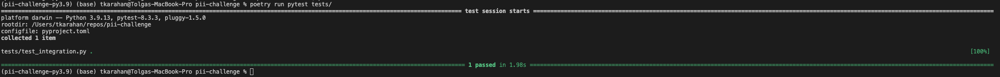

## How to run
1. Run docker-compose command to build and start services:
`docker-compose up`

2. Change directory to `pii_challenge` folder and run the command below to populate queues:
`poetry run python submit_image_data.py`

3. Services will automatically process the data. You can observe results in `pii_bounding_boxes` queue at `localhost:15672`. 

## How to run Integration tests
1. Export PYTHONPATH in the root directory of the project:  
`export PYTHONPATH=$(pwd)`
2. Run docker-compose command in another terminal to start services:
`docker-compose up`
3. When all service up and running, execute the pytest command to run the test from root project directory:
`poetry run pytest tests/`

